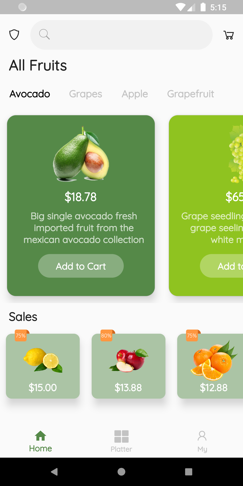
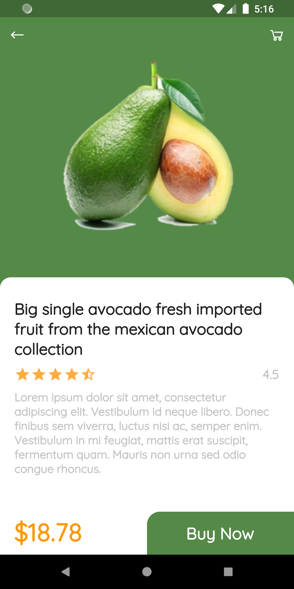
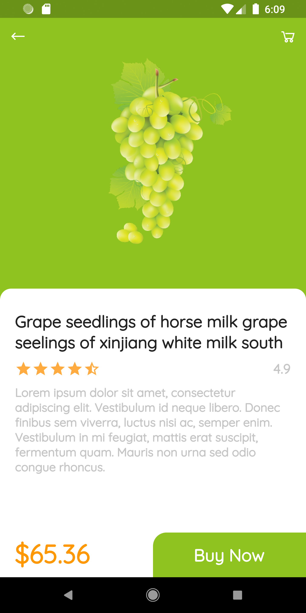
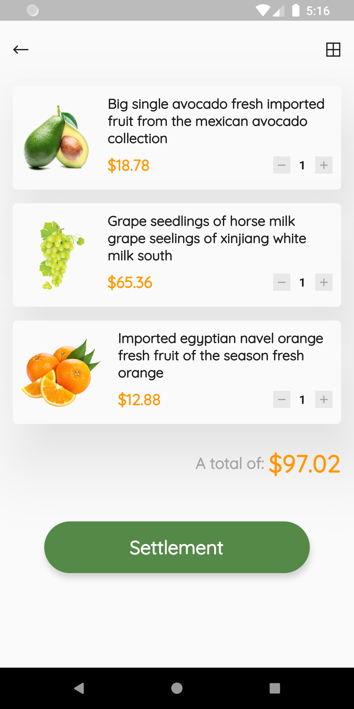

# Flutter UI for  a Fruit Store

A Flutter UI design implementation for a Fruit Store App inspired by <a href="https://dribbble.com/Zhubajie">Zhubajie's</a> desgin on <a href="https://dribbble.com/shots/6752461-Fresh-app">Dribble</a>.

Star this repo if you like what you see.

## 📸 Screenshots

   

## Author(s)
**Emmanuel Fache**

## Getting Started

**Note**: Make sure your Flutter environment is setup.
#### Installation

In the command terminal, run the following commands:

    $ git clone https://github.com/emrade/flutter-ui-fruit-store.git fruit_store
    $ cd fruit_store/
    $ flutter packages get
    $ flutter run

##### Check out Flutter’s online [documentation](http://flutter.io/) for help getting started with your Flutter project.
